<!-- omit in toc -->
# Artsakh Genocide (2022–2023)

> After blockading Artsakh's 100,000 ethnic Armenians for 10 months, Azerbaijan launched a full-scale military assault and displaced nearly all of the region's population. This modern-day genocide underscores the failure of western diplomacy.

You may freely copy any part of this document to spread awareness. If you are already familiar with this conflict and are wondering how you can help, jump to [what you can do](#what-you-can-do).

<!-- omit in toc -->
## Table of Contents
- [Historical Background](#historical-background)
- [The Artsakh Genocide (2022–2023)](#the-artsakh-genocide-20222023)
  - [The Lachin Corridor blockade](#the-lachin-corridor-blockade)
  - [A binding ICJ order, international condemnation, and genocide alerts](#a-binding-icj-order-international-condemnation-and-genocide-alerts)
  - [Starvation as a weapon of genocide](#starvation-as-a-weapon-of-genocide)
  - [Azerbaijani propaganda and denial of the genocide](#azerbaijani-propaganda-and-denial-of-the-genocide)
  - [Military assault on Artsakh](#military-assault-on-artsakh)
  - [The ethnic cleansing of Artsakh](#the-ethnic-cleansing-of-artsakh)
    - [Fuel depot explosion](#fuel-depot-explosion)
    - [Number of Artsakh refugees who crossed the Armenian border](#number-of-artsakh-refugees-who-crossed-the-armenian-border)
- [Aftermath](#aftermath)
  - [Arrests of Artsakh government officials](#arrests-of-artsakh-government-officials)
  - [Humanitarian aid for Armenia](#humanitarian-aid-for-armenia)
  - [European Parliament resolution to sanction Azerbaijan](#european-parliament-resolution-to-sanction-azerbaijan)
- [Complicity in, and failure to prevent, the genocide](#complicity-in-and-failure-to-prevent-the-genocide)
  - [The European Union](#the-european-union)
  - [Russia](#russia)
  - [The United Kingdom](#the-united-kingdom)
  - [Italy](#italy)
  - [Israel](#israel)
  - [Pakistan](#pakistan)
  - [Turkey](#turkey)
  - [The United States](#the-united-states)
- [What you can do](#what-you-can-do)
  - [Contact your representatives](#contact-your-representatives)
  - [Contact USAID, the Bureau for Conflict Prevention and Stabilization, and the Office of Foreign Assistance](#contact-usaid-the-bureau-for-conflict-prevention-and-stabilization-and-the-office-of-foreign-assistance)
- [Further reading](#further-reading)
  - [Artsakh blockade and genocide (2022–2023)](#artsakh-blockade-and-genocide-20222023)
  - [War crimes and crimes against humanity committed by Azerbaijan](#war-crimes-and-crimes-against-humanity-committed-by-azerbaijan)
  - [Armenophobia and anti-Armenian propaganda in Azerbaijan](#armenophobia-and-anti-armenian-propaganda-in-azerbaijan)
  - [Erasure of Armenian cultural monuments in Artsakh](#erasure-of-armenian-cultural-monuments-in-artsakh)
  - [Caviar diplomacy: Azerbaijani lobbying and influence in Western media and politics](#caviar-diplomacy-azerbaijani-lobbying-and-influence-in-western-media-and-politics)

## Historical Background

Nagorno-Karabakh (known to Armenians as *Artsakh* or, formally, [the Republic of Artsakh](https://en.wikipedia.org/wiki/Republic_of_Artsakh)) is a self-declared republic of 120,000 ethnic Armenians ([2021 estimate](https://web.archive.org/web/20210513113421/https://www.primeminister.am/en/press-release/item/2021/03/25/Nikol-Pashinyan-meeting/)) in the Caucasus. Since [180 BC](https://en.wikipedia.org/wiki/Siege_of_Stepanakert), and up until September 2023, Artsakh was inhabited by a majority Armenian population; it is home to [many ancient Armenian cultural landmarks](https://en.wikipedia.org/wiki/Culture_of_Artsakh), including monasteries, churches, schools, and [thousands of khachkars (Armenian cross-stones)](https://en.wikipedia.org/wiki/Khachkar).

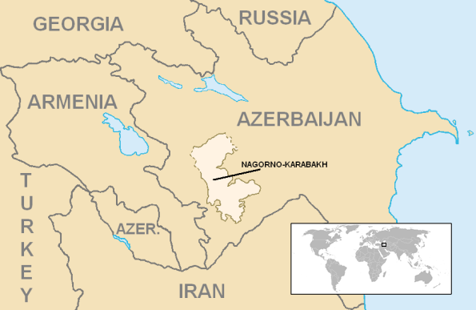

In late 1987, in what would later become known as [the Karabakh Movement](https://en.wikipedia.org/wiki/Karabakh_movement), the majority-Armenian population (76.9%) of the Nagorno-Karabakh Autonomous Oblast expressed its desire to unify with Armenia. This roused anti-Armenian sentiment among Azerbaijanis, and the following years brought waves of ethnic violence targeting Armenians living in Azerbaijan—first in the [Sumgait pogrom (1988)](https://en.wikipedia.org/wiki/Sumgait_pogrom) and again during the [Baku pogrom (1990)](https://en.wikipedia.org/wiki/Baku_pogrom). These events—which displaced Armenians and Azerbaijanis—culminated in the [Siege of Stepanakert (1991)](https://en.wikipedia.org/wiki/Siege_of_Stepanakert), during which Azerbaijan blockaded and bombarded the capital of Artsakh, sparking the First Nagorno-Karabakh War between Armenia and Azerbaijan.

In total, Artsakh endured three armed conflicts initiated by Azerbaijan:

- [First Nagorno-Karabakh War (1988–1994)](https://en.wikipedia.org/wiki/First_Nagorno-Karabakh_War)
- [Second Nagorno-Karabakh War (2020)](https://en.wikipedia.org/wiki/Second_Nagorno-Karabakh_War)
- [Blockade and invasion of Nagorno-Karabakh (September 19, 2023)](https://en.wikipedia.org/wiki/2023_Nagorno-Karabakh_clashes)

## The Artsakh Genocide (2022–2023)

### The Lachin Corridor blockade

On December 12, 2022, [Azerbaijan blockaded the Lachin Corridor](https://www.forbes.com/sites/ewelinaochab/2023/08/08/lachin-corridor-blockade-starves-nagorno-karabakh/)—the sole land link connecting Artsakh to Armenia and the rest of the world—under the fake pretext of [environmental activism](https://time.com/6257467/armenia-azerbaijan-nagorno-karabakh-lachin-environment-icj/). Eventually, the blockade evolved into a coordinated effort to **ethnically cleanse Artsakh** of its Armenian population through starvation and the use of military force.

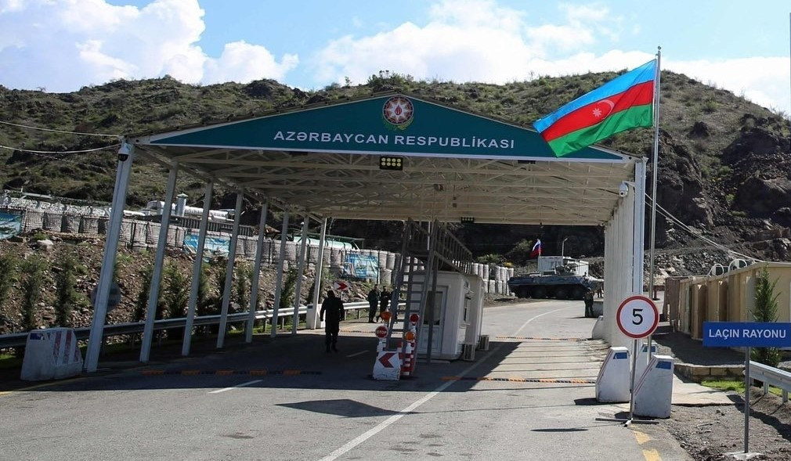

The [2020 trilateral ceasefire agreement](https://en.wikipedia.org/wiki/2020_Nagorno-Karabakh_ceasefire_agreement) signed by Armenia and Azerbaijan is clear about the status of the Lachin Corridor:

> The Lachin Corridor (5 km wide), which will provide a connection between Nagorno-Karabakh and Armenia while not passing through the territory of Shusha, shall remain under the control of the Russian Federation peacemaking forces. The Republic of Azerbaijan shall guarantee the security of persons, vehicles and cargo moving along the Lachin Corridor in both directions. 

In violation of this agreement, Azerbaijan blockaded the Lachin Corridor in December 2022 and prevented the safe passage of persons, vehicles, and cargo in both directions.

### A binding ICJ order, international condemnation, and genocide alerts

On February 22, 2023, the International Court of Justice—the UN's highest court—[issued a legally binding ruling](https://www.icj-cij.org/public/files/case-related/180/180-20230222-ORD-01-00-EN.pdf) ordering Azerbaijan to end the blockade and allow free movement of civilians in both directions; Azerbaijan ignored this order with impunity. The blockade was condemned internationally by [members of the U.S. Congress](https://www.congress.gov/bill/118th-congress/house-resolution/108?s=1&r=97), the UN, the European Union, Human Rights Watch, Amnesty International, the Red Cross, the Lemkin Institute for Genocide Prevention, and countless others.

On August 7, 2023, former International Criminal Court prosecutor Luis Moreno Ocampo [published a report noting that these actions amount to genocide](https://luismorenoocampo.com/wp-content/uploads/2023/08/Armenia-Report-Expert-Opinion.pdf), comparable to war crimes committed in Srebrenica during the Bosnian genocide:

> ... there is reasonable basis to believe that President Aliyev has Genocidal intentions: he has knowingly, willingly and
voluntarily blockaded the Lachin Corridor even after having been placed on notice regarding the consequences of his actions by the ICJ’s provisional orders.

On August 18, the Lemkin Institute issued [an active genocide alert for Artsakh](https://www.lemkininstitute.com/active-genocide-alert-1/active-genocide-alert-azerbaijan----in-artsakh-).

On August 23, 2023, former U.N. Special Advisor on the Prevention of Genocide Juan Méndez published [a preliminary opinion report](https://un.mfa.am/file_manager/un_mission/Preliminary%20Opinion%20-%2023.08.2023.pdf) urging the international community to act before atrocities take place in Artsakh.

### Starvation as a weapon of genocide

Early on in the blockade, Red Cross (ICRC) vehicles were granted intermittent passage to tend to critically ill patients. [From July to September 18, 2023](https://www.icrc.org/en/document/azerbaijan-armenia-sides-must-reach-humanitarian-consensus-to-ease-suffering), Azerbaijan did not permit the Red Cross to enter Artsakh via any route:

> Despite persistent efforts, the International Committee of the Red Cross (ICRC) is not currently able to bring humanitarian assistance to the civilian population through the Lachin corridor or through any other routes, including Aghdam.

As a result of the blockade, food was severely rationed in Artsakh; miscarriages tripled, and medical complications rose sharply. Baby formula, essential hygiene products, and basic food necessities were all in critically short supply, and [people were reportedly fainting in bread queues](https://www.bbc.com/news/world-europe-66646677). [Photos and videos taken by residents and local journalists](https://www.youtube.com/watch?v=eScflb61W0E) showed rows of empty store shelves throughout Artsakh's supermarkets.

On July 26, [a convoy of Armenian trucks carrying 360 tons of food](https://www.rferl.org/a/azerbaijan-blocks-armenian-aid-convoy-/32522087.html) became stranded just outside the Lachin Corridor checkpoint after Azerbaijani officials denied it entry.

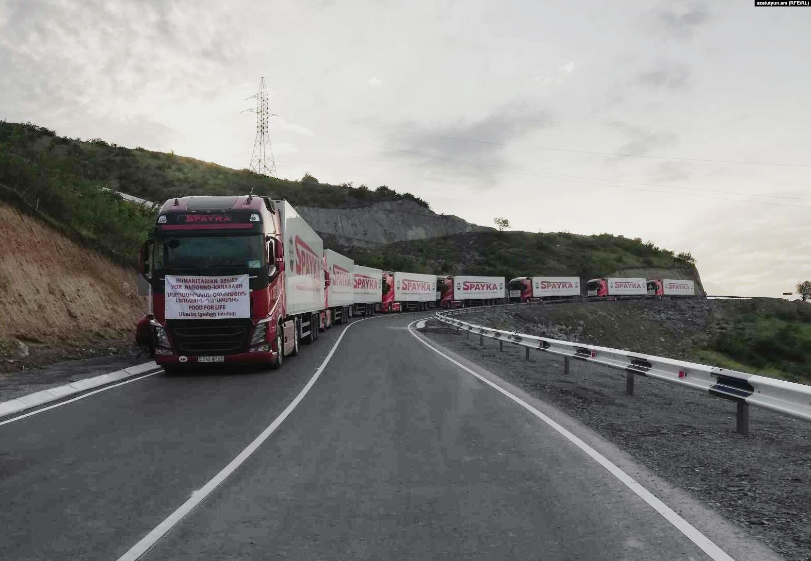
> Image source: [azatutyun.am (RFE/RL)](https://www.rferl.org/a/azerbaijan-blocks-armenian-aid-convoy-/32522087.html)

On August 15, 2023, photos circulated on social media showing the emaciated body of K. Hovhannisyan, a 40-year-old resident of Artsakh who [died of malnourishment and starvation](https://armenpress.am/eng/news/1117440.html).

  
<strong>Warning</strong>: graphic image

  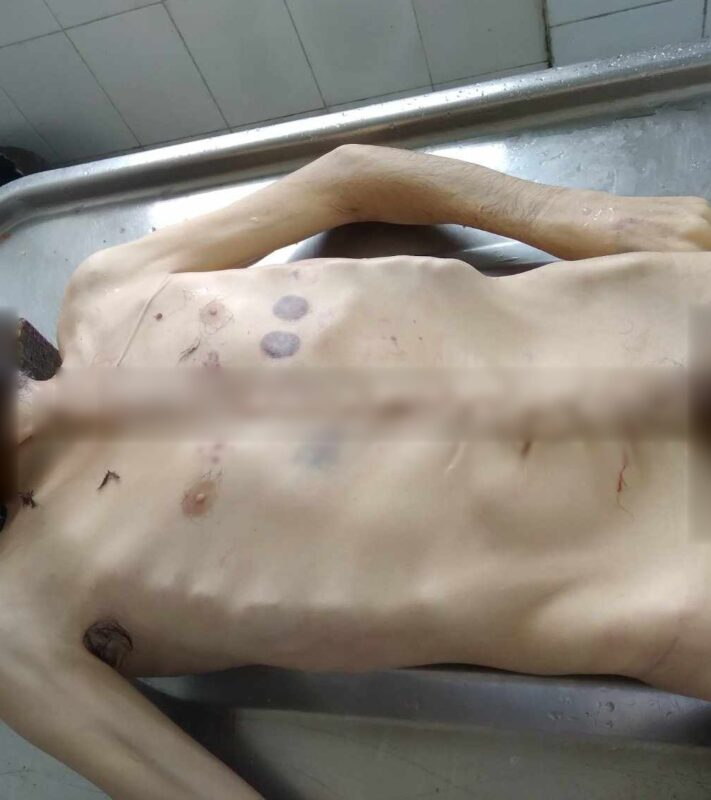

In late August 2023, the mayor of Paris accompanied [a French convoy of humanitarian aid](https://en.armradio.am/2023/08/30/french-humanitarian-convoy-banned-from-entering-artsakh/) to the Lachin Corridor; they, too, were barred from entering.

### Azerbaijani propaganda and denial of the genocide

[According to Azerbaijani state propaganda](https://www.politico.eu/article/nagorno-karabakh-armenia-azerbaijan-blockade-checkpoint/), there was never any blockade and people were free to move in either direction. This stance was echoed by Azerbaijan's representative to the UN during [the August 16 emergency UNSC meeting](https://media.un.org/en/asset/k14/k1498sf9lh). At the same time, Azerbaijan proposed transporting its own humanitarian aid via [an alternative land route through the town of Aghdam](https://jam-news.net/baku-offers-road-through-agdam-instead-of-lachin/).

These conflicting narratives raise two important questions:

1. First, if there was no blockade, what was the need for humanitarian aid or an alternative transportation route? The Red Cross goes where it is needed—places where there is an active humanitarian crisis.
2. Second, if Azerbaijan truly intended to make peace with the Armenians of Artsakh, why did it impose this barbaric blockade in the first place and attempt to starve them into accepting its terms of negotiation?

President Aliyev demanded that Artsakh lay down its arms and dissolve its government [in exchange for amnesty](https://oc-media.org/aliyev-ready-to-offer-amnesty-to-stepanakert-authorities-if-they-dissolve-government-and-parliament/). It made these assurances while [arbitrarily arresting Armenians and illegally abducting them from the ICRC's custody](https://en.armradio.am/2023/07/29/the-arrest-of-a-person-under-the-protection-of-international-humanitarian-law-and-the-icrc-is-a-war-crime-armenian-mfa/) at the Lachin checkpoint. This is the same government whose soldiers [mutilated and beheaded these Armenians](https://azeriwarcrimes.org/atrocities/), violated multiple ceasefires, [fired upon civilian farmers](https://asbarez.com/artsakh-farmers-again-targeted-by-azerbaijani-gunfire/), and blockaded the region for 10 months.

### Military assault on Artsakh

In early September 2023, Azerbaijan [began massing troops on the border of Artsakh and Armenia](https://www.telegraph.co.uk/world-news/2023/09/15/azerbaijani-troops-russian-style-symbols-armenia-border/). [Videos circulating on social media](https://www.instagram.com/p/Cw0pkO-MuM-/) showed Azerbaijani military vehicles with special markings carrying a large number of troops towards the Armenian border.

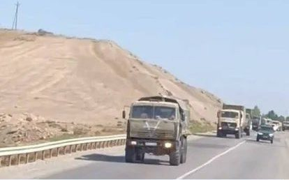

On September 19, 2023, [Azerbaijan launched a large-scale assault on Artsakh with drones and mortars](https://www.economist.com/europe/2023/09/19/azerbaijan-wants-to-reintegrate-nagorno-karabakh-through-force), damaging civilian structures, injuring hundreds, killing civilians, and displacing thousands of ethnic Armenians.

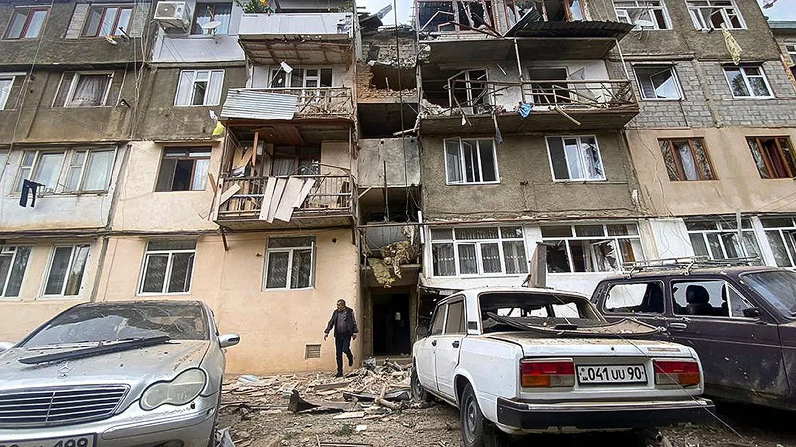
> Image credit: Associated Press

Much like how President Putin justified his invasion of Ukraine in 2022 as a "[special military operation](https://en.wikipedia.org/wiki/On_conducting_a_special_military_operation)," President Aliyev also claimed that Azerbaijan was conducting an "anti-terrorist military operation." He vowed to carry out this operation to its end.

On September 20, 2023, to prevent the further loss of life, [the government of Artsakh surrendered](https://www.nytimes.com/2023/09/20/world/europe/azerbaijan-armenia-cease-fire.html).

[Artsakh / Nagorno-Karabakh Human Rights Ombudsman](https://twitter.com/ArtsakhOmbuds/status/1704551860999242216):

> As of 21:30, September 20, according to the information collected by the Office of the Human Rights Defender, there are at least 200 deaths and more than 400 wounded persons. The number of injured people among the civilian population exceeds 40 persons, among whom 13 are children. There are 10 confirmed civilian deaths at the moment, among whom 5 are children. The fact-finding activities by our Office, aimed at established the fate of missing people, continue.

### The ethnic cleansing of Artsakh

In the aftermath of Azerbaijan's military assault, over 40,000 displaced Armenian refugees initially fled to Stepanakert Airport, with tens of thousands more stranded and encircled by Azeri forces on the outskirts of Artsakh. Many Armenians had lost contact with their family members.

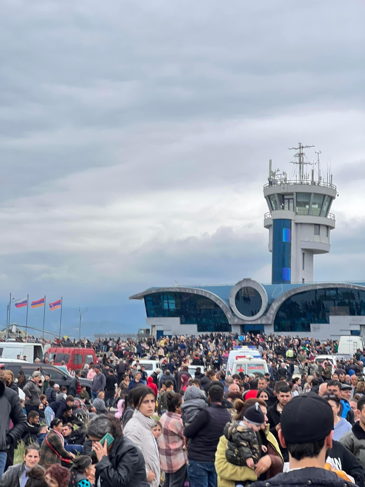

On September 23, the Red Cross [delivered 70 tons of humanitarian supplies to affected areas in Artsakh](https://twitter.com/icrc/status/1705633759519773034) and evacuated 17 wounded people.

On September 26, [USAID Administrator Samantha Power visited towns in Armenia near the Lachin Corridor](https://www.usaid.gov/news-information/press-releases/sep-27-2023-administrator-samantha-power-continues-her-trip-armenia-visiting-towns-near-lachin-corridor) and pledged $11.5m in humanitarian aid from the United States to help with the refugee crisis.

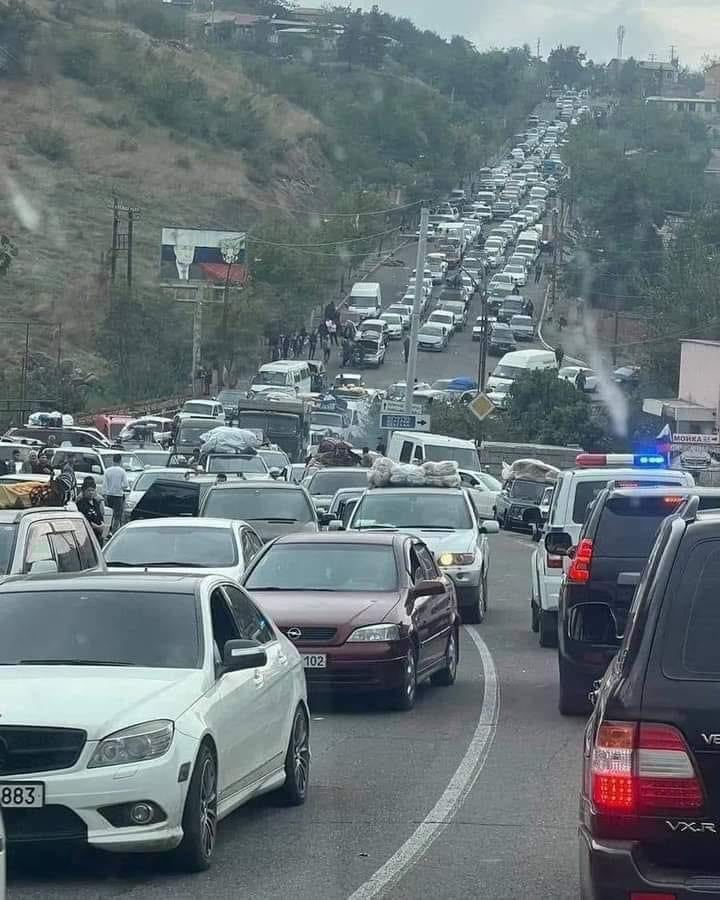
> [Image credit: Neil Hauer on Twitter](https://twitter.com/NeilPHauer/status/1706324226242756670/photo/1)

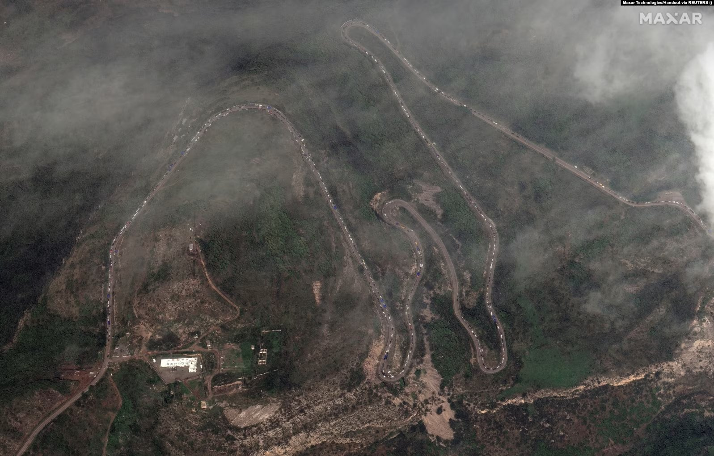
> [Image credit: Maxar Technologies/Reuters](https://twitter.com/ianbremmer/status/1707128224197579112/photo/1)

As many legal experts had warned for months leading up to these events, the forced displacement of Artsakh's Armenian population [amounts to a war crime](https://www.reuters.com/world/asia-pacific/nagorno-karabakh-exodus-amounts-war-crime-legal-experts-say-2023-09-29/):

> Whatever the history and the lack of independent reports on events inside the isolated territory, several international legal experts believe the mass flight fits the legal definition of a war crime.
>
> The ICC's founding documents say that, when referring to forcible transfer or deportation, "the term 'forcibly' is not restricted to physical force, but may include threat of force or coercion, such as that caused by fear of violence, duress, detention, psychological oppression or abuse of power against such person or persons or another person, or by taking advantage of a coercive environment".
>
> Such a "coercive environment" was created in Nagorno-Karabakh before the offensive by Azerbaijan's obstruction of essential supplies, said international lawyer Priya Pillai and Melanie O'Brien, visiting professor at the University of Minnesota and president of the International Association of Genocide Scholars.

#### Fuel depot explosion

On September 25, [a fuel depot exploded in Artsakh](https://armenpress.am/eng/news/1120814/) as Armenians were queueing up to refuel their vehicles before fleeing. As of September 29, the death toll reportedly stood at 170, with hundreds more severely injured and transported to Armenia for treatment. Several countries dispatched medical teams to Armenia to help treat these burn victims.

#### Number of Artsakh refugees who crossed the Armenian border

|Date & time (local)|Number of refugees that entered Armenia|Source|
|----:|------------------------------------------------------:|:------|
|2023-09-24|377|[Reuters](https://www.reuters.com/world/armenia-calls-un-mission-monitor-rights-nagorno-karabakh-2023-09-24/)|
|2023-09-25 06:00|2,906|[Armenpress](https://armenpress.am/eng/news/1120411.html)|
|2023-09-25 17:00|6,650|[Armenpress](https://armenpress.am/eng/news/1120469.html)|
|2023-09-26 08:00|13,550|[Armenpress](https://armenpress.am/eng/news/1120521.html)|
|2023-09-26|20,270|[Armenpress](https://armenpress.am/eng/news/1120604.html)|
|2023-09-26 20:00|28,120|[Armenpress](https://armenpress.am/eng/news/1120608.html)|
|2023-09-27 08:00|42,500|[Armenpress](https://armenpress.am/eng/news/1120635.html)|
|2023-09-27 15:00|50,243|[Armenpress](https://armenpress.am/eng/news/1120663.html)|
|2023-09-27 19:00|53,629|[Armenpress](https://armenpress.am/eng/news/1120682.html)|
|2023-09-28 08:00|65,036|[Armenpress](https://armenpress.am/eng/news/1120698.html)|
|2023-09-28 10:00|66,500|[Armenpress](https://armenpress.am/eng/news/1120710.html)|
|2023-09-28 12:00|68,386|[Armenpress](https://armenpress.am/eng/news/1120726.html)|
|2023-09-28 14:00|70,500|[Armenpress](https://armenpress.am/eng/news/1120757.html)|
|2023-09-28 18:00|74,400|[Armenpress](https://armenpress.am/eng/news/1120786.html)|
|2023-09-28 20:00|76,407|[Armenpress](https://armenpress.am/eng/news/1120795.html)|
|2023-09-29 06:00|84,770|[Armenpress](https://armenpress.am/eng/news/1120803.html)|
|2023-09-29 10:00|88,780|[Armenpress](https://armenpress.am/eng/news/1120829.html)|
|2023-09-29 12:00|91,448|[Armenpress](https://armenpress.am/eng/news/1120871.html)|
|2023-09-29 18:00|97,735|[Armenpress](https://armenpress.am/eng/news/1120895.html)|
|2023-09-30|100,417|[Armenpress](https://armenpress.am/eng/news/1120924.html)|
|2023-09-30 14:00|100,437|[Armenpress](https://armenpress.am/eng/news/1120943.html)|
[2023-10-01 12:00|100,483|[Armenpress](https://armenpress.am/eng/news/1120958.html)|
|2023-10-01 16:00|100,490|[Armenpress](https://armenpress.am/eng/news/1120966.html)|
|2023-10-02|100,520|[Armenpress](https://armenpress.am/eng/news/1121012.html)|

## Aftermath

### Arrests of Artsakh government officials

Following the dissolution of Artsakh and the mass exodus of refugees to Armenia, Azerbaijan began arresting former government officials, including:

- [Ruben Vardanyan](https://www.theguardian.com/world/2023/sep/27/former-state-minister-of-nagorno-karabakh-ruben-vardanyan-arrested-by-azerbaijan), former State Minister of Artsakh
- [David Babayan](https://www.armenpress.am/eng/news/1120700/), presidential advisor
- [Levon Mnatsakanyan](https://armenpress.am/eng/news/1120852.html), former commander of the Artsakh Defence Army
- [Davit Manukyan](https://armenpress.am/eng/news/1120867.html), former First Deputy Commander of the Artsakh Defence Army
- Arshavir Gharamyan, former director of Artsakh's National Security Service
- [Bako Sahakyan](https://armenpress.am/eng/news/1121116/), third president of Artsakh (2007–2020)
- [Arkadi Ghukasyan](https://armenpress.am/eng/news/1121116/), second president of Artsakh (1997–2007)
- [Davit Ishkhanyan](https://armenpress.am/eng/news/1121116/), president of the Artsakh National Assembly
- [Arayik Harutyunyan](https://apnews.com/article/azerbaijan-nagorno-karabakh-armenia-separatist-arrest-dcbb7290c2f3343c5e1c37827fd50533), fourth president of Artsakh (2020–2023)

### Humanitarian aid for Armenia

To help Armenia deal with the influx of refugees from Artsakh, foreign governments and non-profits offered various forms of humanitarian aid to Armenia and organizations providing aid in the region:

|Party|Assistance|Article links|
|:-----------------|:----------|:------|
|France|A total of €12.5 million in aid since the beginning of 2023.|[diplomatie.gouv.fr](https://www.diplomatie.gouv.fr/en/country-files/azerbaijan/news/article/nagorno-karabakh-france-mobilizes-additional-assistance-27-09-23)|
|USAID and U.S. State Department|$11.5 million|[usaid.gov](https://www.usaid.gov/news-information/press-releases/), [reuters.com](https://www.reuters.com/world/germanys-baerbock-calls-azerbaijan-allow-observers-enter-karabakh-2023-09-27/)|
|European Union   |€10.45 million in monetary aid, along with direct humanitarian aid.|[ec.europa.eu](https://ec.europa.eu/commission/presscorner/detail/en/ip_23_4787), [European Commissioner for Crisis Management](https://twitter.com/JanezLenarcic/status/1710582811613135031)|
|Germany|€5 million in funding for the Red Cross|[armenpress.am](https://armenpress.am/eng/news/1119217.html)|
|Italy|€4 million in funding for the Red Cross|[esteri.it](https://www.esteri.it/en/sala_stampa/archivionotizie/comunicati/2023/10/vice-ministro-cirielli-dispone-stanziamento-di-4-mln-euro-di-fondi-maeci-cooperazione-allo-sviluppo-a-favore-della-croce-rossa-per-interventi-urgenti-in-favore-delle-popolazioni-del-nagorno-karabak/)|
|Canada|$2.5 million in funding for the Red Cross|[canada.ca](https://www.canada.ca/en/global-affairs/news/2023/09/canada-provides-humanitarian-assistance-funding-in-response-to-nagorno-karabakh-crisis.html)|
|Japan|$2 million|[Ministry of Foreign Affairs of Japan](https://www.mofa.go.jp/press/release/press4e_003308.html)|
|Norway|$1.85 million|[armradio.am](https://en.armradio.am/2023/09/30/norway-contributes-1-85-million-in-humanitarian-assistance-to-the-civilian-population-of-nagorno-karabakh/)|
|Spain|€1 million|[Minister of Foreign Affairs José Manuel Albares](https://twitter.com/jmalbares/status/1707437064323543504)|
|World Food Programme (WFP)|<ul><li>4,000 food packages</li><li>21,000 hot meals</li><li>food parcels for 30,000 people</li><li>food cards for 6,000 people</li></ul>|[wfp.org](https://www.wfp.org/news/world-food-programme-responds-humanitarian-crisis-thousands-people-flee-armenia)|
|Poland|<ul><li>10 tons of food</li><li>200 beds</li><li>$200,000 in monetary aid</li></ul>|[gov.pl](https://www.gov.pl/web/diplomacy/deputy-minister-wojciech-gerwel-takes-part-in-delivery-of-humanitarian-aid-to-armenia)|
|Lithuania|€350k|[Minister of Foreign Affairs Gabrielius Landsbergis](https://twitter.com/GLandsbergis/status/1709561317718102359)|
|Czech Republic|€200k|[Ambassador of the Czech Republic to Armenia](https://twitter.com/petr_piruncik/status/1709212618286592087), |
|Belgium|Dispatched a medical team to Armenia to help treat victims of the September 25 fuel depot explosion.|[diplomatie.belgium.be](https://diplomatie.belgium.be/en/news/b-fast-offers-medical-assistance-armenia-after-explosion-fuel-depot-nagorno-karabakh)|
|Iran|60 tons of humanitarian aid|[news.am](https://news.am/eng/news/784768.html)|
|Israel|Dispatched a medical team to Armenia to help treat victims of the September 25 fuel depot explosion.|[jpost.com](https://www.jpost.com/israel-news/article-761887)|
|World Health Organization (WHO)|<ul><li>Support for victims of the fuel depot explosion in Artsakh.</li><li>Three months' worth of medicine to cover the treatment of non-communicable diseases for 50,000 people.</li></ul>|[who.int](https://www.who.int/europe/news/item/01-10-2023-racing-to-meet-the-health-needs-of-refugees-entering-armenia)|
|UNICEF|Support for children displaced by the conflict.|[news.un.org](https://news.un.org/en/audio/2023/10/1141972)|

### European Parliament resolution to sanction Azerbaijan

On October 5, 2023, members of the European Parliament (MEPs) voted on [a resolution condemning Azerbaijan's ethnic cleansing of Artsakh](https://www.europarl.europa.eu/news/en/press-room/20230929IPR06132/nagorno-karabakh-meps-demand-review-of-eu-relations-with-azerbaijan). The overwhelming majority of the MEPs—491 in favor, 9 against, and 36 abstained—called on the European Union to adopt sanctions against Azerbaijan and reconsider its relations with Baku.

> In a resolution adopted on Thursday, Parliament strongly condemns Azerbaijan’s pre-planned and unjustified military attack against Nagorno-Karabakh on 19 September, which MEPs say constitutes a gross violation of international law and human rights and a clear infringement of previous attempts to achieve a ceasefire. With over 100,000 ethnic Armenians having been forced to flee the enclave since the latest offensive, MEPs say the current situation amounts to ethnic cleansing and strongly condemn threats and violence committed by Azerbaijani troops against the Armenian inhabitants of Nagorno-Karabakh.
> 
> They also call on the EU and member states to immediately offer all necessary assistance to Armenia to deal with the influx of refugees from Nagorno-Karabakh and the subsequent humanitarian crisis.
> 
> Appalled by Azerbaijan’s latest attack, Parliament calls on the EU to adopt targeted sanctions against the government officials in Baku responsible for multiple ceasefire violations and human rights abuses in Nagorno-Karabakh. While reminding the Azeri side that it bears full responsibility for ensuring the safety and well-being of all people in the enclave, MEPs demand investigations into abuses committed by Azerbaijani troops that may constitute war crimes.

## Complicity in, and failure to prevent, the genocide

The UN's [Genocide Convention](https://www.un.org/en/genocideprevention/genocide-convention.shtml) states:

> Importantly, the Convention establishes on State Parties the obligation to take measures to prevent and to punish the crime of genocide, including by enacting relevant legislation and punishing perpetrators, “whether they are constitutionally responsible rulers, public officials or private individuals” (Article IV). That obligation, in addition to the prohibition not to commit genocide, have been considered as norms of international customary law and therefore, binding on all States, whether or not they have ratified the Genocide Convention.

Despite this responsibility, several countries and politicians are morally complicit in this genocide—through inaction, corruption, and their funding of Azerbaijan's petro-dictatorship.

### The European Union

On July 18, 2022, Ursula von der Leyen, President of the EU, [signed a gas deal with Azerbaijan](https://ec.europa.eu/commission/presscorner/detail/da/statement_22_4583) to increase imports of Azeri gas in order to compensate for shortages caused by the war in Ukraine. Just a few months later, in November 2022, Azerbaijan [struck a deal to import gas from Russia](https://eurasianet.org/azerbaijans-russian-gas-deal-raises-uncomfortable-questions-for-europe), raising questions about where Europe would be purchasing its gas from.

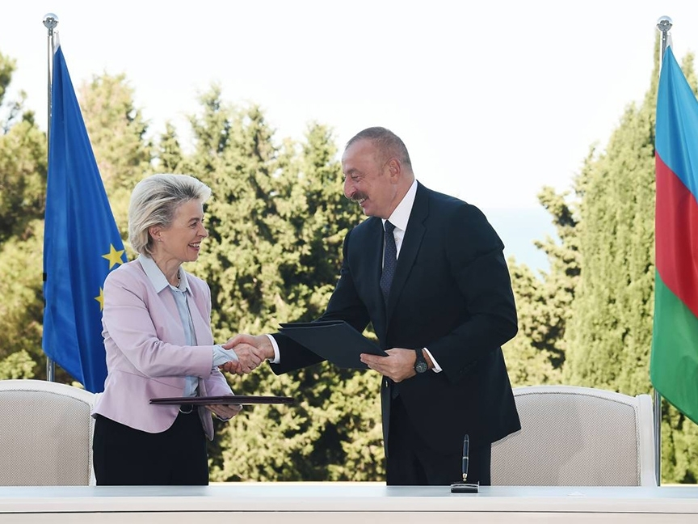
> Ursula von der Leyen (left) and President Aliyev (right) shake hands during a meeting to sign a new energy deal. Image source: president.az.

By increasing its economic dependence on Azerbaijan, the EU gave Azerbaijan the political leverage that it needed to tighten its chokehold on Artsakh. While the EU did deploy a border-monitoring mission to Armenia in January 2023, this did little to abate Azerbaijan's aggression—in June 2023, the Azerbaijani ambassador to the EU [openly threatened the monitoring mission on Twitter](https://euobserver.com/world/157246); on August 15, 2023, Azerbaijan [fired across the border in the direction of the EU delegates](https://www.politico.eu/article/azerbaijan-armenia-border-gunfire-european-union-observers-verin-shorzha-united-nations-nagorno-karabakh/). Nor did the presence of this monitoring mission deter Azerbaijan's military assault in September of 2023.

### Russia
This should not come as a surprise in light of Russia's unprovoked invasion of Ukraine. After the 2020 Artsakh war, Russia [deployed a peacekeeping contingent of 2,000 soldiers](https://en.wikipedia.org/wiki/2020_Nagorno-Karabakh_ceasefire_agreement#Overview) to Artsakh as part of the ceasefire agreement signed by Armenia and Azerbaijan. The peacekeepers have done nothing to maintain peace in the region; they are a symbol of Russia's impotence and dwindling regional influence. Armenian Prime Minister Nikol Pashinyan has [repeatedly criticized CSTO member Russia](https://eurasianet.org/tensions-rise-between-armenia-russia) for its inaction in the blockade. President Putin also reportedly [ordered Russian state media to blame Armenia](https://www.themoscowtimes.com/2023/09/20/kremlin-orders-media-lawmakers-to-blame-armenia-for-karabakh-conflict-reports-a82527) for Azerbaijan's September 19 assault on Artsakh, and Russian peacekeepers stood idly by as Azerbaijan carried out the attacks.

### The United Kingdom
From 2012 to 2014, [Azerbaijan used four British companies to launder $2.9 billion into Europe](https://www.theguardian.com/world/2017/sep/04/uk-at-centre-of-secret-3bn-azerbaijani-money-laundering-and-lobbying-scheme) to bribe politicians and journalists and discourage criticism of Aliyev's dictatorship. The legacy of this scandal lives on today in the West's reluctance to condemn or sanction Aliyev.

### Italy
Italy spends more on Azerbaijani exports than any other European country; in 2022 alone, it [imported $17B worth of goods from Azerbaijan](https://tradingeconomics.com/azerbaijan/exports-by-country)—more than eight times as much as Turkey did. Azerbaijan is also a key energy and military partner for Italy—in 2023, Italy signed [a $170M deal to install gas turbines in Azerbaijan](https://www.nasdaq.com/articles/italys-ansaldo-energia-signs-$171-mln-gas-turbine-deal-in-azerbaijan) at an electric power plant; in June 2023, [Azerbaijan reached a deal to purchase military aircraft from Italy](https://eurasianet.org/azerbaijan-to-buy-italian-military-aircraft).

Like their [German](https://www.vice.com/en/article/qjp74b/azerbaijan-lobbying-germany-angela-merkel-ilham-aliyev) and British counterparts, [some Italian politicians were bribed by Azerbaijan](https://www.occrp.org/en/daily/13628-italian-court-sentences-former-council-of-europe-mp-for-bribery) to paint the country in a positive light.

### Israel
Israel has been [actively arming Azerbaijan with modern weaponry since 2016](https://armenianweekly.com/2023/03/08/israels-massive-supply-of-sophisticated-weapons-to-azerbaijan/) in an attempt to weaken Iran. Azerbaijan's main cargo arline, Silk Way Airlines, [makes regular trips to the Ovda military base in Tel Aviv](https://hetq.am/en/article/159676), where it acquires weapons and other supplies—weapons like the LORA ballistic missiles and kamikaze drones that [Azerbaijan used against Armenians](https://www.csis.org/analysis/air-and-missile-war-nagorno-karabakh-lessons-future-strike-and-defense) during the Second Nagorno-Karabakh War.

### Pakistan
Pakistan and Azerbaijan have [close ties in the energy and arms sectors](https://eurasianet.org/azerbaijan-ties-with-pakistan-focusing-on-arms-and-energy). During the September 19 attacks, Azerbaijani soldiers [filmed themselves using the Pakistani-made KRL-122 Ghazab multiple launch rocket system](https://twitter.com/OSPSF/status/1704087209349959924) against the people of Artsakh.

### Turkey
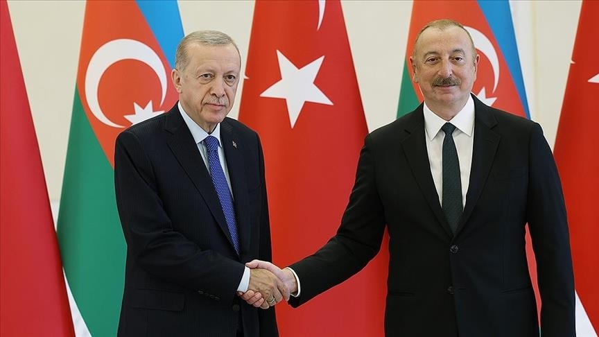
> Image source: [President Erdogan discusses latest situation in Karabakh with Azerbaijani counterpart](https://www.aa.com.tr/en/world/president-erdogan-discusses-latest-situation-in-karabakh-with-azerbaijani-counterpart-/2997316)

Denial of the first Armenian genocide is [the official state policy of Turkey](https://www.mfa.gov.tr/the-armenian-allegation-of-genocide-the-issue-and-the-facts.en.mfa). During the Second Nagorno-Karabakh War between Armenia and Azerbaijan in 2020, Turkey actively armed Azerbaijan in pursuit of [its own geopolitical goals](https://nationalinterest.org/feature/what-does-turkey%E2%80%99s-pan-turkic-eurasian-pivot-hold-pakistan-201381) of creating a greater Turkic World. In his December 2020 speech at the victory day parade in Baku, President Erdogan appealed to this surging Turkish nationalism and [openly praised the perpetrators of the Armenian genocide](https://44days.info/speech-by-president-recep-tayyip-erdogan/):

> Today the soul of Azerbaijan’s national poet, great fighter Ahmad Javad will rejoice. Today the soul of Nuri Pasha, Enver Pasha, brave soldiers of the Caucasian Islamic Army will rejoice. Today the soul of one of the first Azerbaijani martyrs, Mubariz Ibrahimov, will rejoice. Today is a day of victory and pride for all of us, for the entire Turkic world.

During [the UNSC emergency meeting on August 16, 2023](https://media.un.org/en/asset/k14/k1498sf9lh) concerning the Lachin Corridor, Turkey's representative parroted Azerbaijan's claim that there is no blockade.

### The United States
In 1992, after the first Artsakh war, Congress passed the Freedom Support Act; [Section 907](https://en.wikipedia.org/wiki/Section_907) of this act bans direct U.S. aid to Azerbaijan. In 2001, the Senate amended the act to allow the President to waive Section 907; every single president has exercised this right since then. Since 2001, the U.S. has provided [over $470 million in military aid to Azerbaijan](https://securityassistance.org/security-sector-assistance/).

President Biden never issued any statements concerning Azerbaijan's nine-month blockade of President Aliyev. Biden also did not mention or denounce Azerbaijan's shelling of Artsakh on September 19, the same day he was attending the 78th UN General Assembly during which he [proudly proclaimed](https://www.whitehouse.gov/briefing-room/speeches-remarks/2023/09/19/remarks-by-president-biden-before-the-78th-session-of-the-united-nations-general-assembly-new-york-ny/):

> If we abandon the core principles of the UN Charter to appease an aggressor, can any member state in this body feel confident that they are protected? 

[Yuri Kim](https://www.state.gov/biographies/yuri-kim/), Principal Deputy Assistant Secretary of State for Europe and Eurasian Affairs, [claimed during a September 14 hearing](https://www.foreign.senate.gov/hearings/assessing-the-crisis-in-nagorno-karabakh) that the United States would not tolerate the use of military force to settle the disputes over Artsakh:

> The United States will not countenance any effort or action—short-term or long term—to ethnically cleanse or commit other atrocities against the Armenian people of Nagorno-Karabakh.

## What you can do

### Contact your representatives

You have a **civic and moral obligation to make your voice heard**. If you live in the United States:

1. Visit [https://www.congress.gov/members/find-your-member](https://www.congress.gov/members/find-your-member).
2. Enter your home address.
3. Contact your senators and house representatives.

Call your representatives and urge them to pressure the Biden administration to stop Azerbaijan from ethnically cleansing 120,000 Armenians in Artsakh. Call on the U.S. to sanction Azerbaijan like it did Russia. Call on the U.S. to [stop waiving Section 907 of the Freedom Support Act and funding Azerbaijani aggression](https://www.federalregister.gov/documents/2022/07/05/2022-14190/extension-of-waiver-of-section-907-of-the-freedom-support-act-with-respect-to-assistance-to-the).

Even if you do not reside in the U.S., **your voice can still make an impact**. Join the [Turkish writers, politicians, and human rights defenders](https://www.agos.com.tr/en/article/29016/call-by-citizens-of-turkey-to-international-community-to-end-the-blockade-of-karabagh) who have publicly voiced their opposition to the blockade. Show solidarity with the Armenians of Artsakh. Ask your government's representatives to send humanitarian aid to Armenia to accommodate refugees from Artsakh and military aid to deter future Azeri aggression.

### Contact USAID, the Bureau for Conflict Prevention and Stabilization, and the Office of Foreign Assistance

Follow the steps outlined in [this Google Doc](https://docs.google.com/document/u/1/d/e/2PACX-1vT2OTAucYDHukUqwSFYu1zZj7a7k6EP1BLhYAj8YR0YOpY7F1oVyowcbY2R-q47BcXIkkGSI9JnOn3t/pub?pli=1) to contact the Head of USAID, the Bureau for Conflict Prevention and Stabilization, and the Office of Foreign Assistance and urge them all to increase military and humanitarian aid to Armenia. This is essential to deter further Azeri aggression in the region.

## Further reading

The links below provide important context on this decades-long conflict between Armenia and Azerbaijan.

### Artsakh blockade and genocide (2022–2023)
- [Blockade of the Republic of Artsakh (2022–present)](https://en.wikipedia.org/wiki/Blockade_of_the_Republic_of_Artsakh_(2022%E2%80%93present))
- [February 22, 2023 ICJ order](https://www.icj-cij.org/public/files/case-related/180/180-20230222-ORD-01-00-EN.pdf) | [Archive](https://web.archive.org/web/20230314045608/https://www.icj-cij.org/public/files/case-related/180/180-20230222-ORD-01-00-EN.pdf)
- [Sieged and Starved: 120,000 Armenians](https://providencemag.com/2023/05/sieged-and-starved-120000-armenians/) | [Archive](https://web.archive.org/web/20230000000000*/https://providencemag.com/2023/05/sieged-and-starved-120000-armenians/)
- [Nagorno-Karabakh: 'People are fainting queuing up for bread'](https://www.bbc.com/news/world-europe-66646677) | [Archive](https://web.archive.org/web/20230923055135/https://www.bbc.com/news/world-europe-66646677)
- [Nagorno-Karabakh conflict: supermarket shelves empty as food shortages hit](https://www.youtube.com/watch?v=eScflb61W0E)
- [The Post's View: Azerbaijan should reopen the Lachin corridor — and avert another war](https://www.washingtonpost.com/opinions/2023/08/16/azerbaijan-nagorno-karabakh-blockade-armenia/) | [Archive](https://web.archive.org/web/20230816223437/https://www.washingtonpost.com/opinions/2023/08/16/azerbaijan-nagorno-karabakh-blockade-armenia/)
- [Armenians face genocide in Azerbaijan, former International Criminal Court prosecutor warns](https://apnews.com/article/armenia-azerbaijan-nagorno-karabakh-blockade-2a9fb9852534ab38656a99b435f0ba86) | [Archive](https://web.archive.org/web/20230812030025/https://apnews.com/article/armenia-azerbaijan-nagorno-karabakh-blockade-2a9fb9852534ab38656a99b435f0ba86)
- [Expert Opinion: Genocide against Armenians in 2023, by Luis Moreno Ocamp](https://luismorenoocampo.com/wp-content/uploads/2023/08/Armenia-Report-Expert-Opinion.pdf) | [Archive](https://web.archive.org/web/20230923055131/https://luismorenoocampo.com/wp-content/uploads/2023/08/Armenia-Report-Expert-Opinion.pdf)
- [Preliminary opinion on the situation in Nagorno-Karabakh and on the need for the international community to adopt measures to prevent atrocity crimes](https://un.mfa.am/file_manager/un_mission/Preliminary%20Opinion%20-%2023.08.2023.pdf) | [Archive](https://web.archive.org/web/20230923191025/https://un.mfa.am/file_manager/un_mission/Preliminary%20Opinion%20-%2023.08.2023.pdf)
- [The West’s Double Standards in the Armenian Crisis](https://jacobin.com/2023/08/armenian-crisis-western-strategy-double-standards-energy-security) | [Archive](https://web.archive.org/web/20230810231409/https://jacobin.com/2023/08/armenian-crisis-western-strategy-double-standards-energy-security/)
- [Nagorno-Karabakh crisis puts the spotlight on EU ties with Azerbaijan](https://www.politico.eu/article/crisis-in-karabakh-baku-eu-armenia-azerbaijan/) | [Archive](https://web.archive.org/web/20230810232330/https://www.politico.eu/article/crisis-in-karabakh-baku-eu-armenia-azerbaijan/)
- [‘There is no way out’: residents of Nagorno-Karabakh fear worst as Azerbaijan’s troops take control](https://www.theguardian.com/world/2023/sep/24/fear-rises-food-runs-short-karabakh-azerbaijan) | [Archive](https://web.archive.org/web/20230929170541/https://www.theguardian.com/world/2023/sep/24/fear-rises-food-runs-short-karabakh-azerbaijan)
- [Nagorno-Karabakh exodus amounts to a war crime, legal experts say](https://www.reuters.com/world/asia-pacific/nagorno-karabakh-exodus-amounts-war-crime-legal-experts-say-2023-09-29/) | [Archive](https://web.archive.org/web/20230930074243/https://www.reuters.com/world/asia-pacific/nagorno-karabakh-exodus-amounts-war-crime-legal-experts-say-2023-09-29/)

### War crimes and crimes against humanity committed by Azerbaijan
- [Willful killing, mutilation, torture, and inhuman treatment of Armenians by Azerbaijani forces](https://azeriwarcrimes.org/atrocities/) | [Archive](https://web.archive.org/web/20230530133232/https://azeriwarcrimes.org/atrocities/)
- [Aliyev Awards Officer who Decapitated Artsakh Soldier](https://asbarez.com/aliyev-awards-officer-who-decapitated-artsakh-soldier/) | [Archive](https://web.archive.org/web/20230803182352/https://asbarez.com/aliyev-awards-officer-who-decapitated-artsakh-soldier/)
- [Hero’s welcome for Azerbaijan axe murderer](https://www.aljazeera.com/news/2012/9/2/heros-welcome-for-azerbaijan-axe-murderer) | [Archive](https://web.archive.org/web/20230531001742/https://www.aljazeera.com/news/2012/9/2/heros-welcome-for-azerbaijan-axe-murderer)
- [An Execution in Hadrut](https://www.bellingcat.com/news/rest-of-world/2020/10/15/an-execution-in-hadrut-karabakh/) | [Archive](https://web.archive.org/web/20230718170939/https://www.bellingcat.com/news/rest-of-world/2020/10/15/an-execution-in-hadrut-karabakh/)
- [Two men beheaded in videos from Nagorno-Karabakh war identified](https://www.theguardian.com/world/2020/dec/15/two-men-beheaded-in-videos-from-nagorno-karabakh-war-identified) | [Archive](https://web.archive.org/web/20230603193725/https://www.theguardian.com/world/2020/dec/15/two-men-beheaded-in-videos-from-nagorno-karabakh-war-identified)
- [Video Shows Azerbaijan Forces Executing Armenian POWs](https://www.hrw.org/news/2022/10/14/video-shows-azerbaijan-forces-executing-armenian-pows) | [Archive](https://web.archive.org/web/20230726233956/https://www.hrw.org/news/2022/10/14/video-shows-azerbaijan-forces-executing-armenian-pows)
- [Rape and mutilation of Anush Apetyan, an Armenian servicewoman, during a September 2022 incursion into Armenian territory](https://en.wikipedia.org/wiki/Death_of_Anush_Apetyan) | [Archive](https://web.archive.org/web/20230725211959/https://en.wikipedia.org/wiki/Death_of_Anush_Apetyan)
- [Azerbaijan Is Torturing and Beheading Armenians](https://providencemag.com/2022/12/azerbaijan-is-torturing-and-beheading-armenians/) | [Archive](https://web.archive.org/web/20230601191350/https://providencemag.com/2022/12/azerbaijan-is-torturing-and-beheading-armenians/)
- [White Phosphorus in Artsakh / Pt. 1: From the Front Line to the Operating Room](https://www.youtube.com/watch?v=qjwzHkyGYQA)
- [Shusha massacre (1920)](https://en.wikipedia.org/wiki/Shusha_massacre)
- [Sumgait pogrom (1988)](https://en.wikipedia.org/wiki/Sumgait_pogrom)
- [Baku pogrom (1990)](https://en.wikipedia.org/wiki/Baku_pogrom)
- [Garry Kasparov about the Baku Pogrom against Armenians in 1990](https://www.youtube.com/watch?v=RqXubG9MV10)
- [Manufacturing A Massacre: The Armenian Pogroms in Baku](https://www.youtube.com/watch?v=0HLsdNMR4kY)

### Armenophobia and anti-Armenian propaganda in Azerbaijan
- ["Hate, hate, hate!" Why are minors taught to hate in Azerbaijani schools?](https://www.bbc.com/azeri/region-63203019) | [Archive](https://web.archive.org/web/20221117123534/https%3A%2F%2Fwww.bbc.com%2Fazeri%2Fregion-63203019)
- [Azerbaijani postal stamps accused of spreading anti-Armenian propaganda](https://www.new-east-archive.org/articles/show/12442/azerbaijan-stamps-nagorno-karabakh-war-anti-armenian-propaganda) | [Archive](https://web.archive.org/web/20230811004149/https://www.new-east-archive.org/articles/show/12442/azerbaijan-stamps-nagorno-karabakh-war-anti-armenian-propaganda)
- ["We will chase them away like dogs" —Ilham Aliyev, October 17, 2020](https://president.az/en/articles/view/43334) | [Archive](https://web.archive.org/web/20230728122458/https://president.az/en/articles/view/43334)
- [Azerbaijan's 'Ethnic Hatred' Theme Park Draws Ire, Imperils Reconciliation](https://www.rferl.org/a/azerbaijan-karabakh-theme-park-armenia-ethnic-hatred-aliyev/31217971.html) | [Archive](https://web.archive.org/web/20230603081209/https://www.rferl.org/a/azerbaijan-karabakh-theme-park-armenia-ethnic-hatred-aliyev/31217971.html)
- [“Our goal is the complete elimination of Armenians. You, Nazis, already eliminated the Jews in the 1930s and 1940s, right? You should be able to understand us.” —former mayor of Baku](https://www.armenian-assembly.org/azerbaijangenocideintent) | [Archive](https://web.archive.org/web/20230307055813/https://www.armenian-assembly.org/azerbaijangenocideintent)
- [Azerbaijan Threatens Chernobyl-Style ‘Catastrophe’ In Caucasus Drone War](https://www.forbes.com/sites/davidhambling/2020/07/17/threat-of-chernobyl-style-catastrophe-in-caucasus-drone-war/?sh=760d7a197946) | [Archive](https://web.archive.org/web/20230427051835/https://www.forbes.com/sites/davidhambling/2020/07/17/threat-of-chernobyl-style-catastrophe-in-caucasus-drone-war/)
- [Turkish Ultranationalist Group Linked to “Hunt For Armenians” in France](https://www.vice.com/en/article/epddna/turkey-france-armenia-grey-wolves-lyon) | [Archive](https://web.archive.org/web/20230526141556/https://www.vice.com/en/article/epddna/turkey-france-armenia-grey-wolves-lyon)
- [Erdogan's speech after the 44-day war honors Enver Pasha and other orchestrators of the Armenian Genocide](https://44days.info/speech-by-president-recep-tayyip-erdogan/) | [Archive](https://web.archive.org/web/20230606061453/https://44days.info/speech-by-president-recep-tayyip-erdogan/)
- [Debunking Azerbaijani History Books](https://www.youtube.com/watch?v=vlUveFSZxUU)
- [Anti-Armenian flyers promoting 'completion of genocide' appear in Glendale](https://www.foxla.com/news/anti-armenian-flyers-glendale) | [Archive](https://web.archive.org/web/20230605003156/https://www.foxla.com/news/anti-armenian-flyers-glendale)
- [Azeri Telegram channel calling for a second Armenian genocide](https://t.me/patriots_aze/2883) | [Archive](https://web.archive.org/web/20230810083904/https://t.me/patriots_aze/2883)

### Erasure of Armenian cultural monuments in Artsakh
- [Monumental loss: Azerbaijan and 'the worst cultural genocide of the 21st century'](https://www.theguardian.com/artanddesign/2019/mar/01/monumental-loss-azerbaijan-cultural-genocide-khachkars) | [Archive](https://web.archive.org/web/20230807112612/https://www.theguardian.com/artanddesign/2019/mar/01/monumental-loss-azerbaijan-cultural-genocide-khachkars)
- [Report shows near-total erasure of Armenian heritage sites](https://news.cornell.edu/stories/2022/09/report-shows-near-total-erasure-armenian-heritage-sites) | [Archive](https://web.archive.org/web/20230604232614/https://news.cornell.edu/stories/2022/09/report-shows-near-total-erasure-armenian-heritage-sites)
- [Azerbaijan Desecrates Armenian Cultural and Religious Heritage](https://providencemag.com/2022/12/azerbaijan-desecrates-armenian-cultural-and-religious-heritage/) | [Archive](https://web.archive.org/web/20230604232614/https://news.cornell.edu/stories/2022/09/report-shows-near-total-erasure-armenian-heritage-sites)
- [Is the Destruction of Armenian Heritage Not Important Enough for the Getty? ](https://hyperallergic.com/804374/is-the-destruction-of-armenian-heritage-not-important-enough-for-the-getty/) | [Archive](https://web.archive.org/web/20230627023942/https://hyperallergic.com/804374/is-the-destruction-of-armenian-heritage-not-important-enough-for-the-getty/)

### Caviar diplomacy: Azerbaijani lobbying and influence in Western media and politics 
- [UK at centre of secret $3bn Azerbaijani money laundering and lobbying scheme](https://www.theguardian.com/world/2017/sep/04/uk-at-centre-of-secret-3bn-azerbaijani-money-laundering-and-lobbying-scheme) | [Archive](https://web.archive.org/web/20230607235216/https://www.theguardian.com/world/2017/sep/04/uk-at-centre-of-secret-3bn-azerbaijani-money-laundering-and-lobbying-scheme)
- [How an Authoritarian Regime Infiltrated a Government in the Heart of Europe](https://www.vice.com/en/article/qjp74b/azerbaijan-lobbying-germany-angela-merkel-ilham-aliyev) | [Archive](https://web.archive.org/web/20230512103544/https://www.vice.com/en/article/qjp74b/azerbaijan-lobbying-germany-angela-merkel-ilham-aliyev)
- [What’s Behind All the Pro-Azerbaijan Articles?](https://armenianweekly.com/2020/10/24/whats-behind-all-the-pro-azerbaijan-articles/) | [Archive](https://web.archive.org/web/20230201001152/https://armenianweekly.com/2020/10/24/whats-behind-all-the-pro-azerbaijan-articles/)
- [Emily Schrader, an American-Israeli journalist, breaks down Azerbaijan's lobbying campaign in Israel, including bribery of journalists](https://twitter.com/emilykschrader/status/1705124892281123153) | [Archive](https://web.archive.org/web/20230923190252/https://twitter.com/emilykschrader/status/1705124892281123153)

